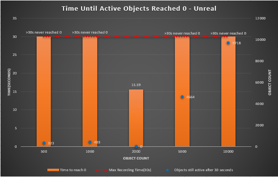
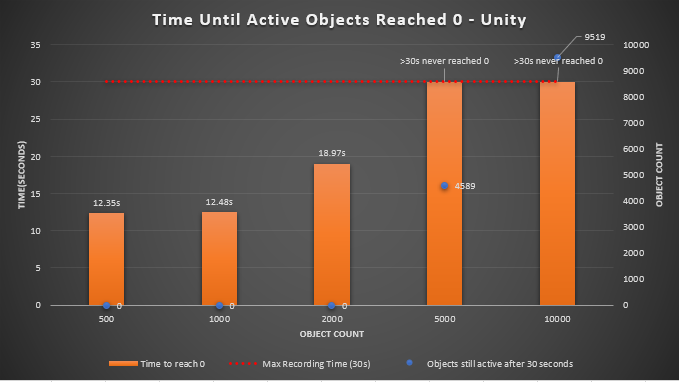
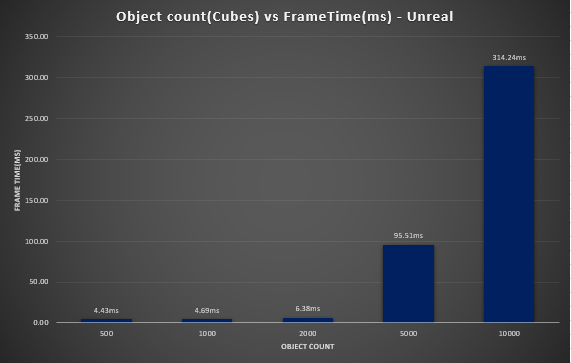
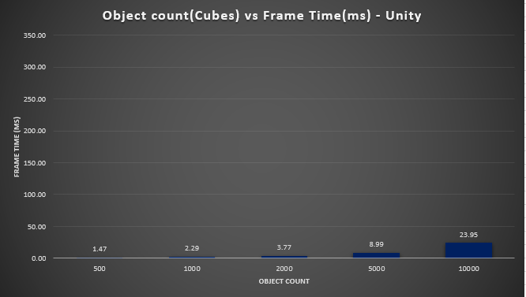
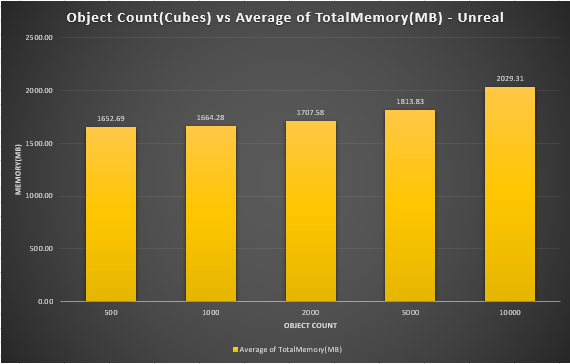
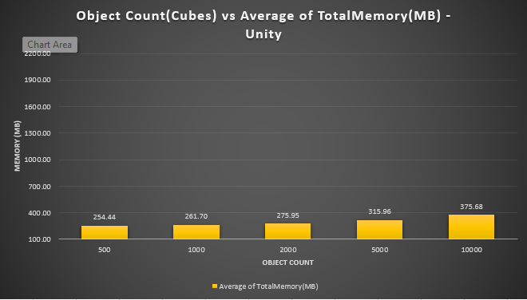

# Advanced Tools – Physics Performance Comparison (Unity vs Unreal Engine)

##  Introduction
This project investigates the **physics simulation performance** between **Unity (PhysX)** and **Unreal Engine (Chaos)**.  
The experiment measures how each engine handles increasing numbers of physics-enabled cubes under identical test conditions.

The comparison focuses on:
- Frame time and scaling performance  
- Memory usage  
- Physics stability (time until all objects become inactive)  

This project was developed for the *Advanced Tools* university module.

---

## ⚙️ How It Works

### Test Setup
- 3D cubes (1×1×1) spawned in a 10×N grid.
- Gravity enabled; no external forces applied.
- Friction = 0.6, Restitution = 0.0, Mass = 1.0 kg.
- Simulation recorded for **30 seconds**.

| Metric | Description |
|:--|:--|
| **FrameTime(ms)** | Time per rendered frame |
| **FPS** | 1 / ΔTime |
| **TotalMemory(MB)** | Current physical memory used |
| **ActiveObjects** | Rigidbodies still simulating physics |

---

### Unity Implementation
- Implemented in `PhysicsStressTest.cs`  
- Used `ProfilerRecorder` for Physics Time and Memory.  
- Spawned 20 cubes per frame via coroutine.  
- Data logged each frame to `PhysicsData_Combined.csv`.

### Unreal Implementation
- Implemented in `PhysicsStressTest.cpp/.h`.  
- Used Chaos physics with equivalent material and mass properties.  
- Spawned 20 actors per frame (matching Unity).  
- Recorded frame time, FPS, total memory, and active rigidbodies to `UnrealPhysicsData.csv`.

---

## Results & Comparison

###  Time Until Active Objects Reached Zero (Stability)

| Unreal Engine | Unity |
|:--:|:--:|
|  |  |

#### Key Observations
- **Unity:** Stable up to 2000 cubes — beyond 5000, many remained active after 30s.  
- **Unreal:** 500–1000 never reached full rest, but 2000 stabilized before 30s — due to Chaos’ non-linear sleep behavior.  
- **Explanation:** In dense stacks, inter-object friction locks movement, causing faster collective rest. At low counts, individual cubes continue micro-motions indefinitely.

---

### Frame Time vs Object Count

| Unreal Engine | Unity |
|:--:|:--:|
|  |  |

| Object Count | Unity FrameTime (ms) | Unreal FrameTime (ms) |
|:--:|:--:|:--:|
| 500 | 1.47 | 4.43 |
| 1000 | 2.29 | 4.69 |
| 2000 | 3.77 | 6.33 |
| 5000 | 8.99 | 95.51 |
| 10000 | 23.95 | 314.24 |

#### Analysis
Unity’s PhysX scales linearly and remains performant up to 10,000 cubes.  
Unreal’s Chaos shows exponential frame time growth due to its more complex constraint solver and higher simulation accuracy.

---

###  Memory Usage vs Object Count

| Unreal Engine | Unity |
|:--:|:--:|
|  |  |

| Object Count | Unity (MB) | Unreal (MB) |
|:--:|:--:|:--:|
| 500 | 254 | 1652 |
| 1000 | 261 | 1664 |
| 2000 | 276 | 1707 |
| 5000 | 316 | 1813 |
| 10000 | 376 | 2029 |

#### Analysis
Unreal consumes **6–8× more memory** due to Chaos’ rigid body island data and UObject overhead.  
Unity’s PhysX memory remains minimal and predictable.

---

## Discussion

The comparison shows a clear trade-off between **efficiency (Unity)** and **accuracy (Unreal)**.

- **Unity (PhysX):**
  - Optimized for real-time gameplay.
  - Predictable scaling and lower memory footprint.
  - Faster sleep detection and simpler solver.
- **Unreal (Chaos):**
  - Prioritizes physical realism and stability.
  - Higher CPU and memory cost.
  - Dense stacks stabilize faster; small scenes jitter longer.

---

## Conclusion

This experiment demonstrates how engine-level physics design impacts scalability and stability.

**In short:**
> Unity = Lightweight, fast, game-focused.  
> Unreal = Accurate, detailed, simulation-focused.

Both engines perform well *within their intended design goals* — Unity for real-time interaction and Unreal for cinematic or high-fidelity simulations.

---

