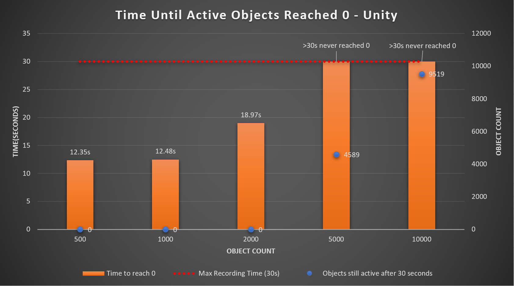
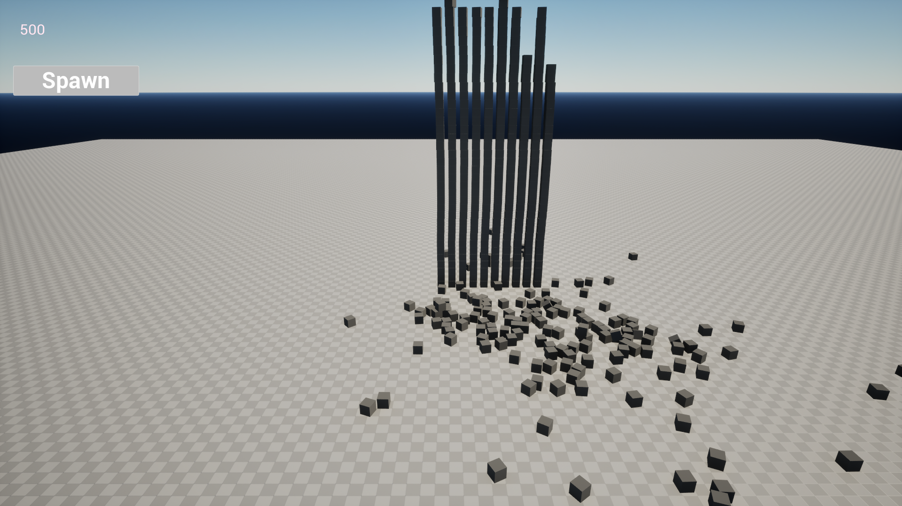
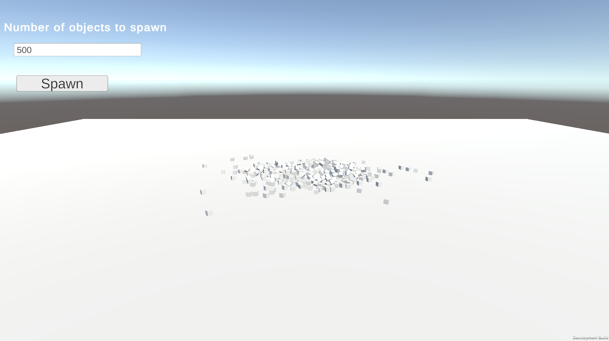
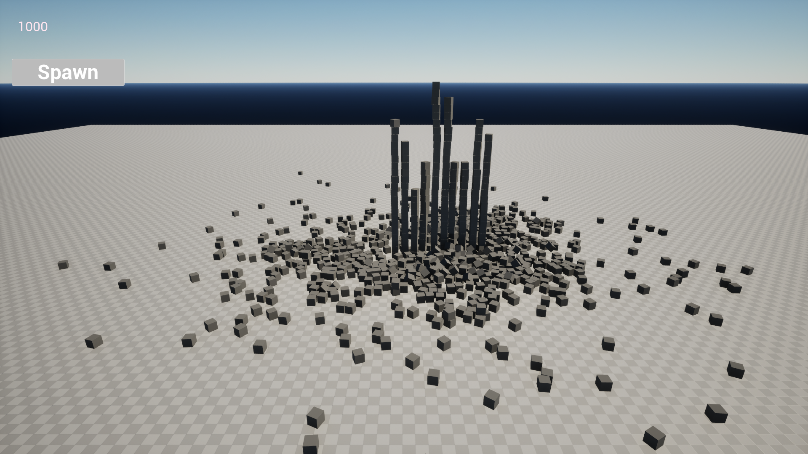
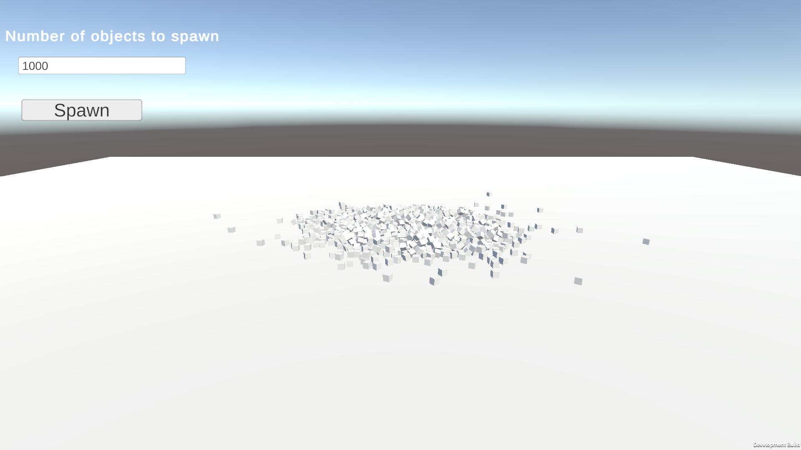
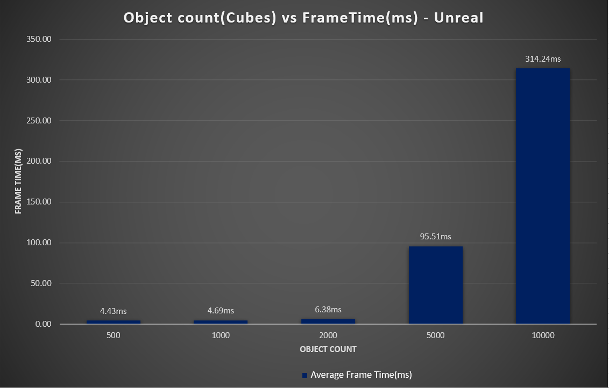
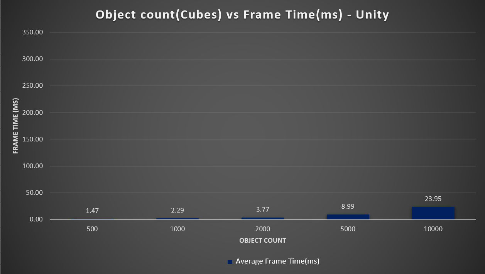
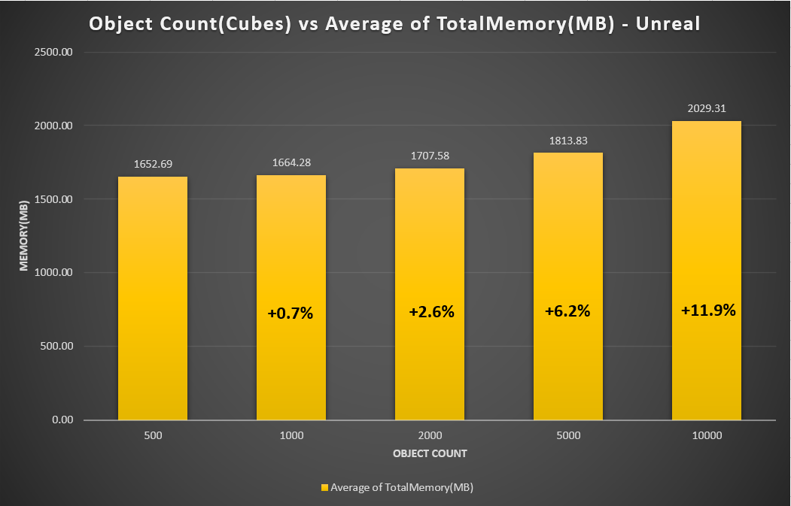
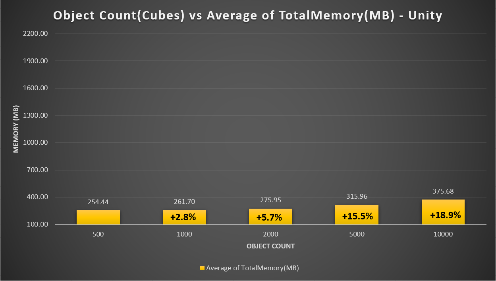

# Advanced Tools – Physics Performance Comparison (Unity vs Unreal Engine)

## Introduction
This project compares the **physics simulation performance** of **Unity 6.2 (PhysX)** and **Unreal Engine 5.7 (Chaos)**.  
The test evaluates how each engine handles an increasing number of physics-enabled cubes under identical test conditions.

The goals were to measure:
- Average **Frame Time (ms)** and scalability with object count  
- **Memory usage** during the simulation  
- **Stability**, represented by how long it takes for all objects to stop simulating physics  

---

## Test Setup

Both Unity and Unreal scenes were built to be **functionally identical** for a fair comparison:

- A **100×100 cube** was used as the floor.  
- A **camera** was positioned to view the spawned cubes.  
- A simple **UI** was included with:
  - An input field to specify the number of cubes to spawn.  
  - A "Spawn" button to initiate the stress test.  

Each test spawned between **500 and 10,000 cubes** arranged in a 10×N grid(where N = ObjectCount/10), spaced evenly apart.

Physics properties were matched as closely as possible:
| Property | Value |
|:--|:--|
| Mass | 1.0 kg |
| Friction | 0.6 |
| Restitution (Bounciness) | 0.0 |
| Gravity | Enabled (default in both engines) |

Simulations ran for **30 seconds**, with data logged every frame.

### Recorded Metrics
| Metric | Description |
|:--|:--|
| **FrameTime (ms)** | Time taken to render a single frame |
| **TotalMemory (MB)** | Physical memory used |
| **ActiveObjects** | Rigidbodies still awake and simulating physics |

---

## Implementation

### Unity (PhysX)
- Script: `PhysicsStressTest.cs`  
- Used `ProfilerRecorder` to track data.  
- Spawned **20 cubes per frame**.  
- Logged results to `PhysicsData_Combined.csv`.

### Unreal (Chaos)
- Script: `PhysicsStressTest.cpp/.h`  
- Used `FPlatformMemory::GetStats()` and Unreal Insights to track data.  
- Spawned **20 cubes per frame**.  
- Logged results to `UnrealPhysicsData.csv`.

---

## Results & Comparison

### Time Until Active Objects Reached Zero (Stability)

  
   
  <em>Figure 1 – Unreal Engine: Time until all cubes stop simulating physics</em>

  
   
  <em>Figure 2 – Unity: Time until all cubes stop simulating physics</em>

#### Analysis

In Unity, the cubes begin to fall and settle quickly, even at lower object counts. This leads to a faster drop in active rigidbodies as the simulation stabilizes. 
Unity’s PhysX implementation tends to resolve stacking instability more aggressively, allowing objects to enter a sleeping state sooner.
 <a href="https://docs.unity3d.com/Manual/PhysicsSection.html" target="_blank">Unity Manual – Physics (PhysX Integration)</a>

In Unreal Engine, the Chaos physics solver maintains more accurate constraint and contact resolution. 
For tests with 500 and 1000 cubes, stable towers remained upright for the entire 30-second duration, preventing the active object count from reaching zero. 
At 2000 cubes, the increased pile density caused the towers to collapse and the engine managed to stabilize after some time. 
For 5000 and 10000 cubes, the towers again collapsed, however, due to the high number of objects and the resulting interactions, both engines were 
unable to fully stabilize within the 30-second test window.
  
This reflects Chaos Physics’ emphasis on stability and realism, even when it results in longer simulation activity.
 <a href="https://dev.epicgames.com/documentation/en-us/unreal-engine/physics-in-unreal-engine" target="_blank">Unreal Engine Documentation – Physics (Chaos)</a>

  
   
  <em>Figure A – Unreal 500 vs Unity 500 – Tower formation in Unreal versus collapsed stacks in Unity</em>

  
   
  <em>Figure B – Unreal 1000 vs Unity 1000 – Towers remaining upright in Unreal, fully collapsed in Unity</em>

This demonstrates a key difference:
Unreal’s Chaos Physics emphasizes **physical realism and stability**, while Unity’s PhysX favors **simplified and more easily reduced interactions**.

---

### Frame Time vs Object Count

  
   
  <em>Figure 3 – Unreal Engine: Average frame time (ms) vs object count</em>

  
   
  <em>Figure 4 – Unity: Average frame time (ms) vs object count</em>

| Object Count | Unity FrameTime (ms) | Unreal FrameTime (ms) |
|:--:|:--:|:--:|
| 500 | 1.47 | 4.43 |
| 1000 | 2.29 | 4.69 |
| 2000 | 3.77 | 6.33 |
| 5000 | 8.99 | 95.51 |
| 10000 | 23.95 | 314.24 |

#### Analysis

Unity’s PhysX maintains near-linear scaling and performs efficiently even with thousands of rigidbodies. 
This is achieved through broad-phase algorithms such as sweep-and-prune, which quickly filter out non-colliding bodies before performing detailed checks. 
The result is consistent frame times and minimal CPU overhead per object.
 <a href="https://docs.unity3d.com/Manual/PhysicsSection.html" target="_blank">Unity Manual – Physics (PhysX Integration)</a> • 
<a href="https://docs.unity3d.com/Manual/PhysicsOptimization.html" target="_blank">Unity Manual – Physics Optimization</a>

Unreal Engine’s Chaos Physics shows a steeper increase in frame time as object count rises. 
Chaos provides a unified, high-fidelity simulation system for rigid bodies, collisions, and constraints, which may lower performance for realism and stability. 
Every body participates fully in constraint solving and contact management, leading to higher computational cost with large numbers of objects.
 <a href="https://dev.epicgames.com/documentation/en-us/unreal-engine/physics-in-unreal-engine" target="_blank">Unreal Engine Documentation – Physics (Chaos)</a>

  
   
  <em>Figure 5 – Unreal Insights trace showing CPU time distribution during the 5000-object test</em>

The Unreal Insights trace above confirms that the majority of frame time is spent in <b>Chaos physics functions</b> such as 
<code>FPBDRigidsEvolutionGBF::AdvanceOneTimeStep</code>, <code>Collisions::GenerateCollisions</code>, and 
<code>Chaos::SolveConstraints</code>. These functions together account for most of the frame time in the slowest frames, 
indicating that <b>physics collision generation and constraint resolution dominate the CPU workload</b> at higher object counts. 
This explains the steep rise in frame time observed in Unreal compared to Unity’s more optimized PhysX implementation.

### Memory Usage vs Object Count

  
   
  <em>Figure 6 – Unreal Engine: Average memory usage (MB) vs object count</em>

  
   
  <em>Figure 7 – Unity: Average memory usage (MB) vs object count</em>

| Object Count | Unity (MB) | Unreal (MB) |
|:--:|:--:|:--:|
| 500 | 254 | 1652 |
| 1000 | 261 | 1664 |
| 2000 | 276 | 1707 |
| 5000 | 316 | 1813 |
| 10000 | 376 | 2029 |

#### Analysis

Unreal Engine consistently consumes <b>6–8× more memory</b> than Unity across all tests. This difference is expected, as Unreal is a much heavier engine overall.The official hardware specifications recommend <b>32&nbsp;GB of RAM</b> for Unreal Engine&nbsp;5, compared to Unity&nbsp;6’s <b>8–16&nbsp;GB</b> requirement, reflecting the higher memory cost of Unreal’s subsystems.   
  <a href="https://dev.epicgames.com/documentation/en-us/unreal-engine/hardware-and-software-specifications-for-unreal-engine" target="_blank">Unreal Engine Hardware Requirements</a> • <a href="https://docs.unity3d.com/6000.3/Documentation/Manual/system-requirements.html" target="_blank">Unity 6 System Requirements</a> 

 When looking at how memory scales with object count, Unreal actually shows a more stable percentage increase than Unity. Between 500 and 10,000 objects, Unreal’s memory usage increased by roughly <b>+22.8%</b>, while Unity’s rose by <b>+47.6%</b>. This indicates that although Unreal starts with a larger baseline, its per-object memory growth is more efficient, suggesting it's well-optimized for managing large numbers of physics bodies. Unity’s lower starting point results in a smaller absolute footprint, but its relative increase is steeper as more objects are introduced. 

---

## Discussion

The results clearly highlight each engine’s priorities:

| Unity (PhysX) | Unreal (Chaos) |
|:--|:--|
| Lightweight, efficient physics simulation | Physically realistic, stable simulation |
| Predictable linear scaling | Non-linear scaling due to solver complexity |
| Minimal memory overhead | Large memory footprint due to detailed state tracking |
| Ideal for real-time gameplay | Ideal for cinematic or high-accuracy simulation |

Unity’s engine optimizes for **speed and scalability**, while Unreal’s Chaos aims for **physical accuracy and realism**.

---

## Conclusion

Both Unity and Unreal Engine are highly capable of simulating physics realistically and efficiently. In most cases, either engine would handle typical gameplay physics well — the choice ultimately 
depends on the project’s goals and performance requirements.

**Overall:**
- **Unity** delivers lower Frame Time, causing higher FPS and lower memory usage, ideal for interactive games and rapid simulation.  
- **Unreal** provides more accurate and stable results, but with significantly higher computational cost.  
